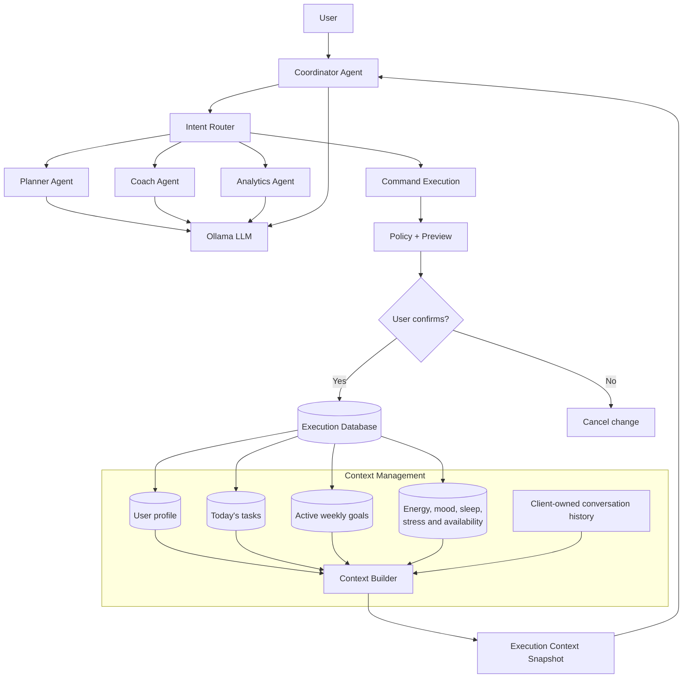

```mermaid
flowchart TB
    User[User] --> Coordinator[Coordinator Agent]

    subgraph Context["Context Management"]
        History[Client-owned conversation history]
        Builder[Context Builder]
        Profile[(User profile)]
        Tasks[(Today's tasks)]
        Goals[(Active weekly goals)]
        CheckIn[(Energy, mood, sleep,<br/>stress and availability)]

        Profile --> Builder
        Tasks --> Builder
        Goals --> Builder
        CheckIn --> Builder
        History --> Builder
    end

    Builder --> Snapshot[Execution Context Snapshot]
    Snapshot --> Coordinator

    Coordinator --> Router[Intent Router]
    Router --> Planner[Planner Agent]
    Router --> Coach[Coach Agent]
    Router --> Analytics[Analytics Agent]
    Router --> Commands[Command Execution]

    Planner --> LLM[Ollama LLM]
    Coach --> LLM
    Analytics --> LLM
    Coordinator --> LLM

    Commands --> Safety[Policy + Preview]
    Safety --> Confirmation{User confirms?}
    Confirmation -->|Yes| Database[(Execution Database)]
    Confirmation -->|No| Cancel[Cancel change]

    Database --> Profile
    Database --> Tasks
    Database --> Goals
    Database --> CheckIn
```