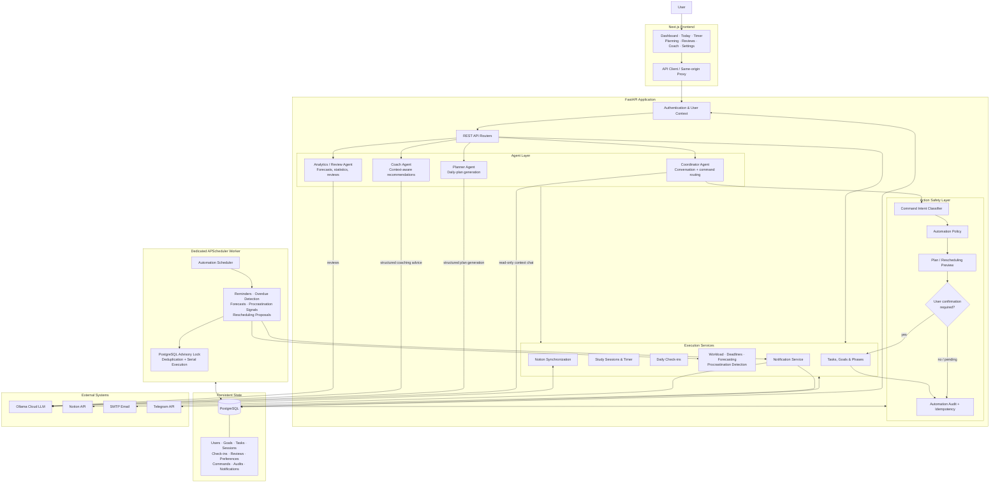

```mermaid
flowchart TB
    U[User]

    subgraph UI["Next.js Frontend"]
        Pages["Dashboard · Today · Timer<br/>Planning · Reviews · Coach · Settings"]
        APIClient["API Client / Same-origin Proxy"]
        Pages --> APIClient
    end

    subgraph Backend["FastAPI Application"]
        Auth["Authentication & User Context"]
        Routes["REST API Routers"]

        subgraph Agents["Agent Layer"]
            Coordinator["Coordinator Agent<br/>Conversation + command routing"]
            Planner["Planner Agent<br/>Daily-plan generation"]
            Coach["Coach Agent<br/>Context-aware recommendations"]
            Analytics["Analytics / Review Agent<br/>Forecasts, statistics, reviews"]
        end

        subgraph Safety["Action Safety Layer"]
            Classifier["Command Intent Classifier"]
            Preview["Plan / Rescheduling Preview"]
            Confirmation{"User confirmation<br/>required?"}
            Policy["Automation Policy"]
            Audit["Automation Audit + Idempotency"]
        end

        subgraph Services["Execution Services"]
            TaskService["Tasks, Goals & Phases"]
            SessionService["Study Sessions & Timer"]
            CheckInService["Daily Check-ins"]
            Intelligence["Workload · Deadlines · Forecasting<br/>Procrastination Detection"]
            NotificationService["Notification Service"]
            NotionService["Notion Synchronization"]
        end
    end

    subgraph Worker["Dedicated APScheduler Worker"]
        Scheduler["Automation Scheduler"]
        Jobs["Reminders · Overdue Detection<br/>Forecasts · Procrastination Signals<br/>Rescheduling Proposals"]
        Lock["PostgreSQL Advisory Lock<br/>Deduplication + Serial Execution"]
        Scheduler --> Jobs --> Lock
    end

    subgraph Data["Persistent State"]
        PostgreSQL[("PostgreSQL")]
        Models["Users · Goals · Tasks · Sessions<br/>Check-ins · Reviews · Preferences<br/>Commands · Audits · Notifications"]
        PostgreSQL --- Models
    end

    subgraph External["External Systems"]
        Ollama["Ollama Cloud LLM"]
        Notion["Notion API"]
        Email["SMTP Email"]
        Telegram["Telegram API"]
    end

    U --> Pages
    APIClient --> Auth --> Routes

    Routes --> Coordinator
    Routes --> Planner
    Routes --> Coach
    Routes --> Analytics
    Routes --> Services

    Coordinator -->|"read-only context chat"| Ollama
    Planner -->|"structured plan generation"| Ollama
    Coach -->|"structured coaching advice"| Ollama
    Analytics -->|"reviews"| Ollama

    Coordinator --> Classifier
    Classifier --> Policy
    Policy --> Preview
    Preview --> Confirmation
    Confirmation -->|"yes"| TaskService
    Confirmation -->|"no / pending"| Audit
    TaskService --> Audit

    Agents --> Services
    Services <--> PostgreSQL
    Auth <--> PostgreSQL
    Safety <--> PostgreSQL

    Worker <--> PostgreSQL
    Jobs --> Intelligence
    Jobs --> NotificationService

    NotificationService --> Email
    NotificationService --> Telegram
    NotionService <--> Notion
```